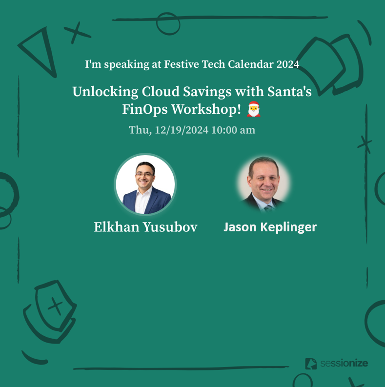

# FinOps-in-Azure

## Unlocking Cloud Savings with Santa's FinOps Workshop! 🎅
## Did you miss our session on Cloud 💲 Savings with Santa's 🚀 FinOps workshop ⁉️ 🤔
#### This repo will contain artifacts from a Festive-Tech Calendar 2024 session

In this session, we have delved into the secrets of FinOps + Azure:
✅ How to standardize and allocate cloud costs 
✅ Why and What of FinOps
✅ Why and What of FinOps
✅ Value of the Focus Framework
✅ FinOps in Azure
✅ Azure Policy - Back to Governance
✅ Demos, and 5 of them :)

We will provide valuable tips and tricks to help you confidently embark on your Cloud FinOps Journey.

By the end of this session, you will have a good understanding of FinOps and be equipped with the necessary knowledge and tools to start monitoring Azure costs and spending.
Moreover, you will learn about Azure Bicep, an IaC language in Azure that can help you automate budget creation across subscriptions.

You can watch the live session 👇👇

